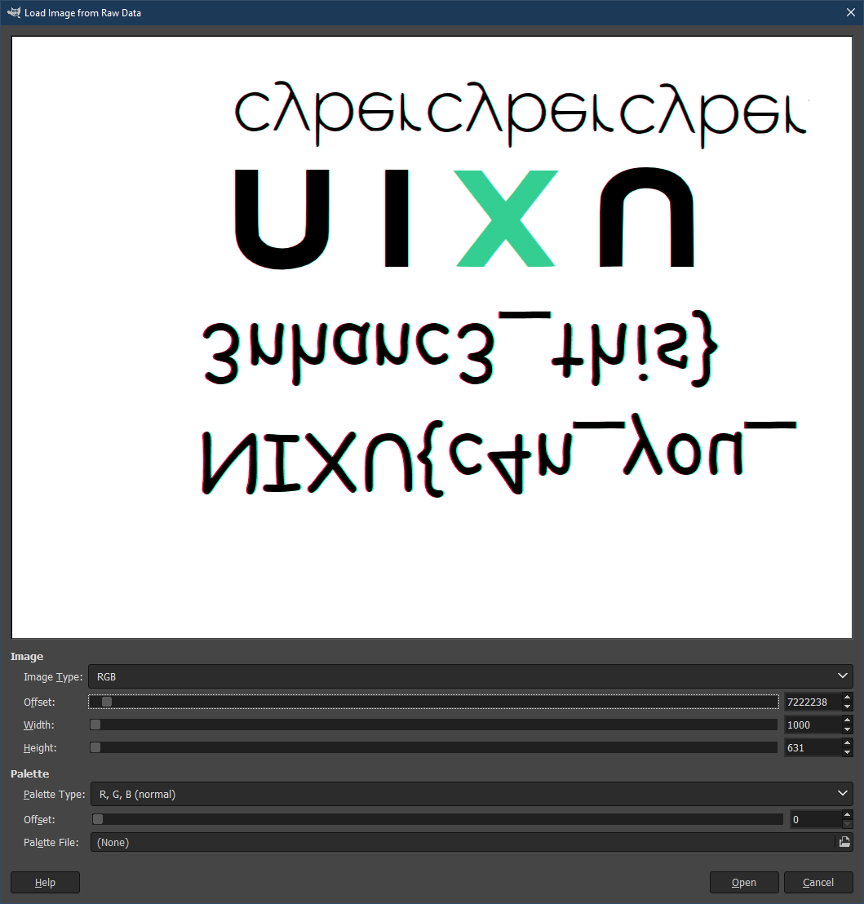

# Bad memories - part 3

## Problem

The lead graphical designer at ACME has noticed some kind of strange activity on her computer. Their IT support believes it is a false positive and the computer will fix itself after turning it off and on again. However, the user managed to take a memory dump just before the crash. Could you help us recover the new design she was working on?

This is part 3 of 5 in a memory dump analysis challenge. The [memory dump file](https://thenixuchallenge.com/c/bad_memories_part1/) can be found from the first part.

## Solution

Open the paint memory dump and recover the image with the flag.

### Painting

The proces list showed a running process of paint.exe. Being a proper designer this must be the program that was being used. To examine the actual work, first extract the paint process memory, similar to notepad in part 1.

```
python vol.py -f c:\dump\mem.dmp --profile Win7SP1x64 pstree

Name                                                  Pid   PPid   Thds   Hnds Time
-------------------------------------------------- ------ ------ ------ ------ ----
. 0xfffffa80014d2060:mspaint.exe                     2816   1840      8    184 2018-12-20 05:29:18 UTC+0000

python vol.py -f c:\dump\mem.dmp --profile Win7SP1x64 memdump -p 2816 --dump-dir c:\dump\badmem3\
```

To view what is inside the memory dump:

- Install GIMP
- Open GIMP and the open file dialog
- Select raw image data as type and open the memory dump
- In the Load image from raw data dialog increase the width and height. Try some popular widths (640, 800, 1000, 1024). The height should be as large as possible to see the most
- Scroll through the data till something shows up vaguely resembling an image shows up. Note! Bitmaps are upside down in memory.
- If something is visible, tune the width to get the proper image
- For this dump, set the width to 1000 to obtain the following image



It is still upside down, but clearly contains a flag. Flipping it vertically shows the flag

``` 
NIXU{###_###_#######_####}
```